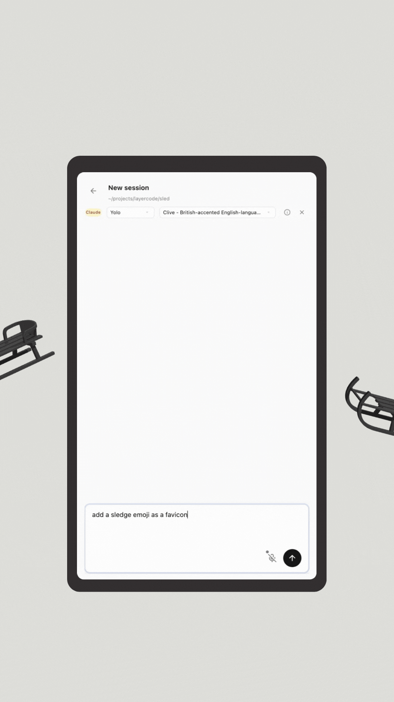

# Sled 🛷

Run your coding agent from your phone. With voice.

<p align="center">
  
</p>

> **This is experimental software.** Like an actual sled: fast and fun, but if you're not careful, you can crash into a tree.

## Why

Coding agents need input every 10-60 minutes. If you're not at your desk, they just sit there.

Typing on a phone is slow. Voice is fast.

Terminals can't do two-way voice. Sled runs in the browser.

That's why Sled exists.

## Install

Clone the repo:

```bash
git clone https://github.com/layercodedev/sled
cd sled
```

Then setup:

```bash
pnpm install
pnpm migrate
```

## Setup

You need a coding agent installed:

```bash
# Claude Code (ACP version required)
npm install -g @anthropic-ai/claude-code@latest

# or Gemini CLI
npm install -g @google/gemini-cli@latest
```

Start Sled:

```bash
pnpm start
```

Open **http://localhost:8787/agents** in your browser.

## Usage

### Talk to your agent

Open Sled on your phone. Tap the microphone. Say what you want.

```
"Add dark mode to the settings page"
```

Sled transcribes and sends it to your agent.

### Hear the response

Your agent works. When it's done, you hear what it did.

```
"I've added a toggle in SettingsPage.tsx and created a ThemeContext.
Want me to add the CSS variables too?"
```

## Mobile Access

> **⚠️ Secure your tunnel.** If you expose your machine without proper authentication (e.g. ngrok without `--basic-auth`), anyone can control your entire computer. Coding agents can run commands, read files, and more. Use strong passwords.

### Tailscale (Recommended)

Install [Tailscale](https://tailscale.com) on your computer and phone. Access Sled over your private network. No ports exposed.

### ngrok (Quick Setup)

```bash
ngrok http 8787 --basic-auth="user:password"
```

Use a strong password. This exposes your machine to the internet.

## Supported Agents

| Agent | Status |
|-------|--------|
| Claude Code | ✔ |
| Gemini CLI | ✔ |
| OpenAI Codex | Coming soon |

## How It Works

```
┌─────────────┐                    ┌──────────────┐                    ┌─────────────┐
│   Phone     │ ◄───Tailscale────► │    Sled      │ ◄───ACP─────────► │ Claude Code │
│  (browser)  │                    │  (your Mac)  │                    │  or Gemini  │
└─────────────┘                    └──────────────┘                    └─────────────┘
```

1. **You talk** — Sled transcribes and sends it to your agent
2. **Agent works** — Runs locally on your computer. Code never leaves your machine.
3. **You hear back** — Response converted to speech

## Features

- **Voice input** — Talk instead of type. Handles camelCase and function names.
- **Voice output** — Responses read aloud. 300+ voices.
- **Notifications** — Agent finishes or needs input. You get a ping.
- **Session resume** — Pick up where you left off.
- **Code stays local** — Your agent runs on your machine. Nothing leaves.

## Tech Stack

- [Hono](https://hono.dev) — Web framework
- [Cloudflare Workers](https://workers.cloudflare.com) — Runtime (local via Wrangler)
- [Durable Objects](https://developers.cloudflare.com/durable-objects/) — Stateful WebSocket handling
- [HTMX](https://htmx.org) — Real-time UI

## Data Routing

Audio and agent responses are sent through [Layercode](https://layercode.com) for voice processing (not stored). You can disable voice output in settings to keep responses local.

## License

[MIT License](LICENSE) © Layercode 